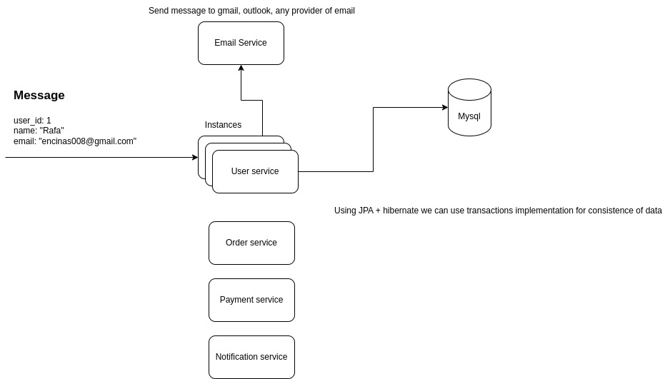

# Getting Started

### Server start up
```cmd
./gradlew clean assemblee bootRun
```


### Postman
## Unary call - Get user


## Server streaming - List of Users


### Design


### Deployment
- Docker - create images about services
- Kubernates - Orchestration of services configure CPU/RAMm, health checks, auto-scaling

### Metrics
- Micrometer - create custom metrics on the services, create grafana for review the metrics

### Database
- Mysql - **concurrency** is controlled using strategies to write as Pessimistic locking.

### Error handler
- Create an error handling centralized for the common exceptions

### Retry
- Configure retry process when the database is down, configure retry in the application properties or server of properties like consul.

### Log entries
- Log entries, contains relevant information about the process like input, parameters and add unique identifier of process or task.  
